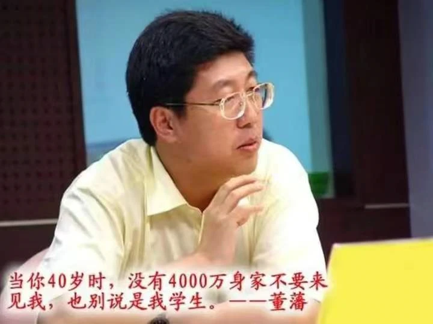

# 董藩：建议农民在县城买房，然后开车去农村种地

8月26日，凤凰网财经《封面直播》对话北师大房地产研究中心主任董藩，解读房地产市场的走向与变革。董藩认为，如果农村的生产经营不受影响，还是主张农民到县城里去住的。因为在县城里享受到的公共服务和接收到的信息等与农村的环境完全不一样，医疗、教育、生活环境等都会有很大的改善，也享受到城市文明和现代文明。如果一些农民仍然需要在农村种地，他可以在需要的时候开着车过去种地。

## 参考

[^1]:[天津日报：农民县城买房，开车回村种地” 建议专家不要建议？](http://epaper.tianjinwe.com/mrxb/html/2022-08/29/content_19044_6656579.htm)
[^2]:[腾讯网：进城买房开车种地：“没4千万不见”的教授被禁！](https://new.qq.com/rain/a/20220829A00IFR00)

